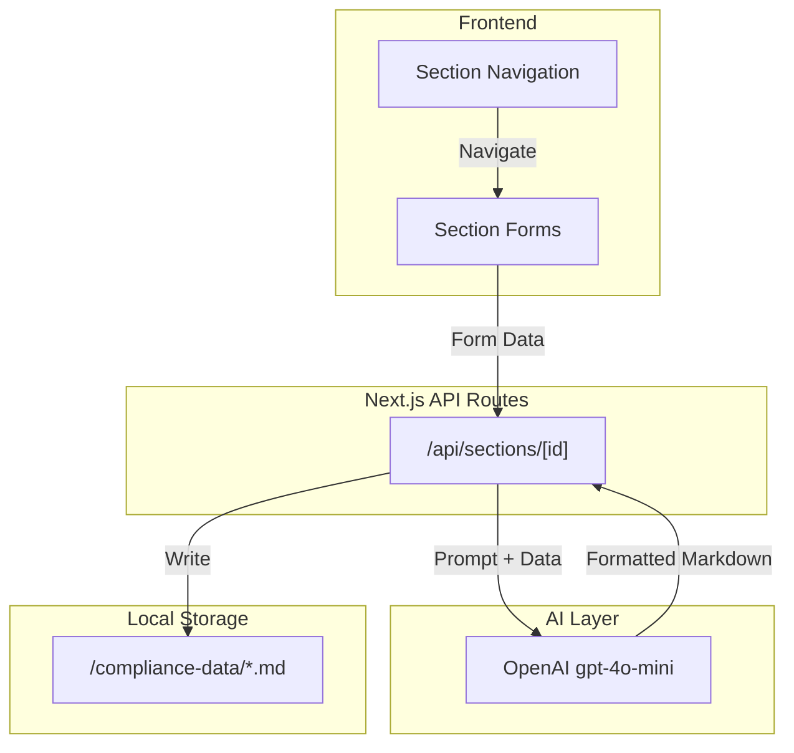

# SOC 2 Compliance Agent

A platform to help companies achieve SOC 2 compliance. The app guides users through gathering required compliance data and generates structured markdown files that can be used by AI agents for further compliance automation.

## Purpose

SOC 2 audits require extensive documentation. This tool:

1. **Guides** users through all required data collection
2. **Structures** information into consistent markdown files
3. **Enables** AI-powered compliance workflows by providing clean, parseable output

The generated markdown files serve as the foundation for downstream tasks like policy generation, evidence collection, and audit preparation.

## Current Features

### Data Gathering (Phase 1)

Users fill out forms across 8 sections. Each section saves to a separate markdown file in `/compliance-data/`.

| Section           | Output File          | Data Collected                          |
| ----------------- | -------------------- | --------------------------------------- |
| Company & Product | `company-product.md` | Legal info, products, architecture      |
| Personnel         | `personnel.md`       | Board, management, employees, org chart |
| Infrastructure    | `infrastructure.md`  | Assets, MDM, security tools, DR plan    |
| Vendors & Tools   | `vendors-tools.md`   | Critical vendors, tool inventory        |
| Data Protection   | `data-protection.md` | Data types processed                    |
| SDLC              | `sdlc.md`            | Version control, CI/CD, repos           |
| Communication     | `communication.md`   | Customer/employee announcements         |
| Offices           | `offices.md`         | Locations, physical security            |

## Planned Features

- Evidence screenshot collection
- Policy document generation
- Control mapping
- Audit readiness checklist

## Architecture



## Project Structure

```
app/
├── (dashboard)/          # Main UI with sidebar layout
│   └── [section]/        # 8 section form pages
├── api/sections/         # Save/load markdown files
components/
├── sidebar.tsx           # Navigation with save status
├── section-form.tsx      # Form wrapper with save button
├── form-fields/          # Reusable input components
lib/
├── ai.ts                 # OpenAI SDK configuration
├── sections.ts           # Section definitions
├── prompts.ts            # AI prompts per section
compliance-data/          # Generated markdown output
```

## Setup

```bash
npm install
```

Create `.env.local`:

```
OPENAI_API_KEY=sk-...
```

Run:

```bash
npm run dev
```

## Tech Stack

- Next.js 16 (App Router)
- Tailwind CSS v4 + shadcn/ui
- Vercel AI SDK + OpenAI
